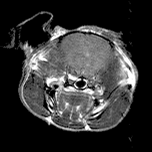
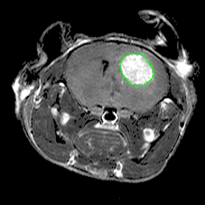
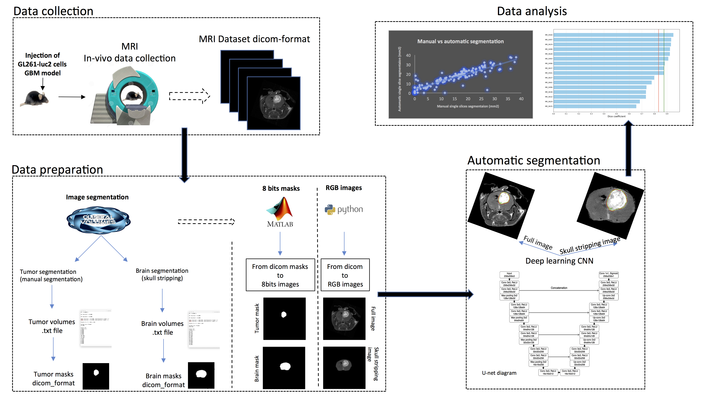

# Deep learning for glioblastoma tumor volume segmentation in mouse

__0.94 DSC (94% accuracy)________________Predicted segmentation_________________Manual segmentation        

.   .     .

## Data preparation

.
